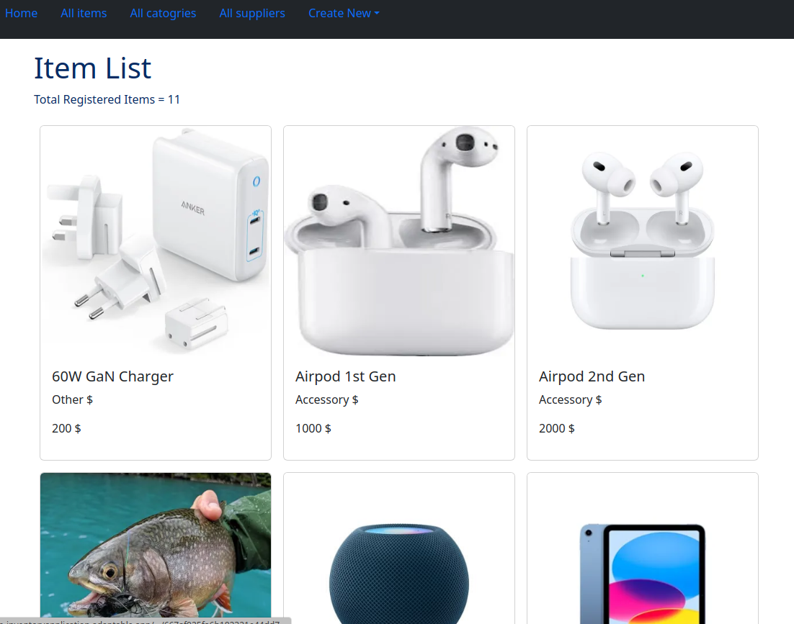

# Inventory Web Apps / Odin-InventoryApplication

A simple full-stack application to CRUD with mongoDB, using Express + Cloudinary. This is part of projects built along The Odin Project Course.

## Live demo
- https://odin-inventoryapplication.adaptable.app/

## Tech stack 
-  Pug / Bootstrap/ Express / mongoDB / Cloudinary

## Source
- https://github.com/WongYC-66/odin-InventoryApplication

## Installation
1. Create account and get your API key from Cloudinary
2. Create .env file and fill in like .env-sample, place ur mongodb connection string at MONGODB_URL
3. npm install
4. npm run serverstart

